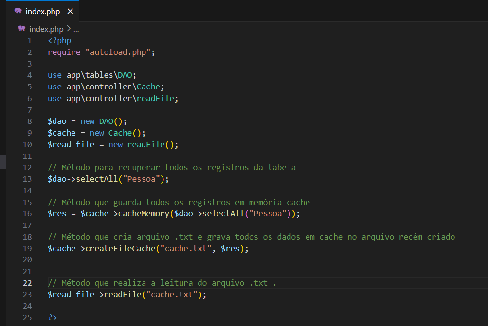

# Setup do exercício
As tecnologias envolvidas neste pequeno projeto foram, PHP, sqLite e arquivo com extensão .txt

### Executando o projeto
O arquivo é executado através do comando "php -S localhost:7000"
[Executando o projeto](app/assets/img/image.png)

### Breve explicação do arquivo index.php
Algumas classes foram instanciadas e comentadas neste arquivo

